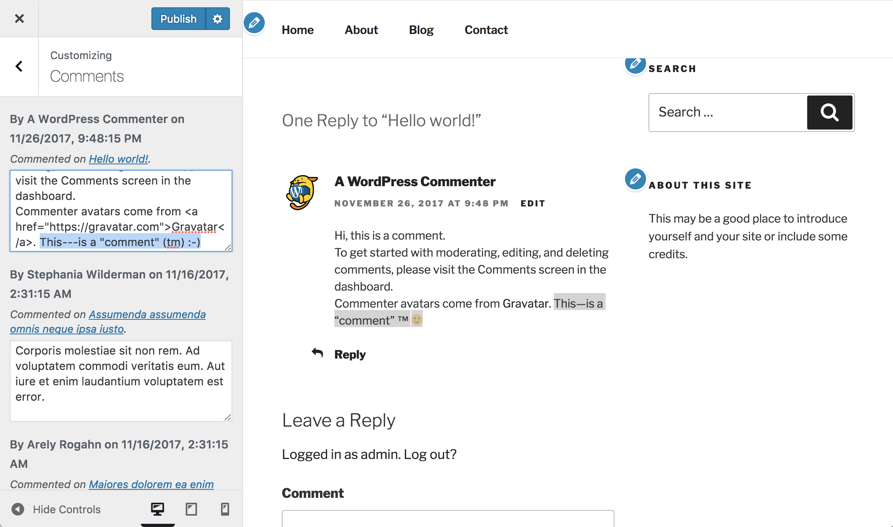
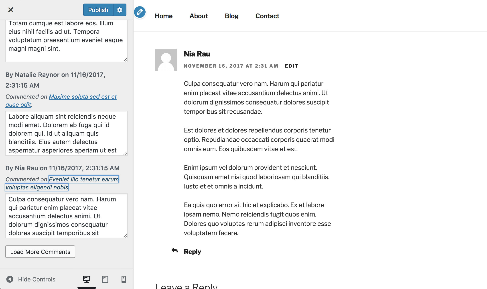

<!-- DO NOT EDIT THIS FILE; it is auto-generated from readme.txt -->
# Customize Comments

Edit comments with live preview and bundle edits in Customizer changesets.

**Contributors:** [xwp](https://profiles.wordpress.org/xwp), [westonruter](https://profiles.wordpress.org/westonruter)  
**Tags:** [customizer](https://wordpress.org/plugins/tags/customizer), [customize](https://wordpress.org/plugins/tags/customize), [comments](https://wordpress.org/plugins/tags/comments)  
**Requires at least:** 4.9  
**Tested up to:** 4.9  
**Stable tag:** 0.1.0  
**License:** [GPLv2 or later](http://www.gnu.org/licenses/gpl-2.0.html)  
**Requires PHP:** 5.4  

  

## Description ##

This plugin is a proof of concept for how comment editing might be added to the Customizer, with edits to comments being staged in changesets along with any other changes made in customziation session. It demonstrates scalable lazy-loading of controls/settings via the REST API. It demonstrates both dynamic settings and dynamic partials.

A new Comments section is added to the Customizer, and when this section is expanded the most recent comments are fetched from the REST API and then are added as textarea controls in the section. A button appears at the bottom of the section for loading subsequent pages of comments.

The comments are listed with the comment author and publish date along with the post it was commented on. Only the comment's content is currently editable. When you do edit a comment that appears in the preview, then the comment will be previewed with selective refresh after a low-fidelity instant preview.

When you navigate to a post and see the comment list, clicking the "Edit Comment" link in the Customizer preview will cause the comment to be loaded into a new textarea control in the section, and the control will then be focused for editing.

This is a natural companion to the [Customize Posts](https://wordpress.org/plugins/customize-posts/) feature plugin.

## Screenshots ##

### Comments edited in the Customizer are previewed with selective refresh.

### Comment controls appear with permalinks to their parent posts; a load more button dynamically loads new comments from the REST API.

## Changelog ##

### 2017-11-26 - 0.1.0 ###
Initial release.

